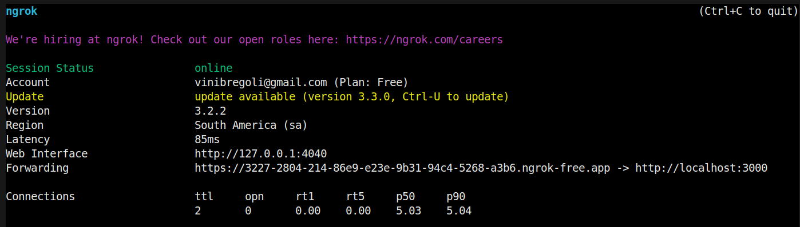
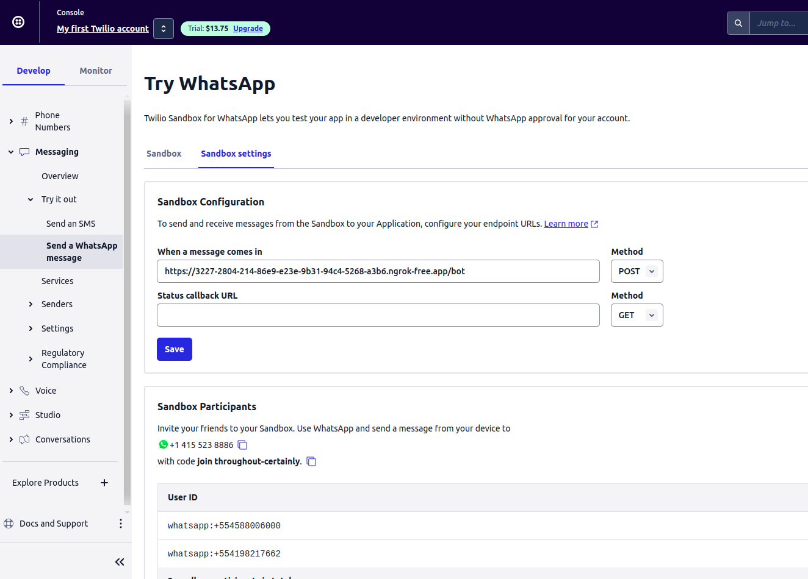
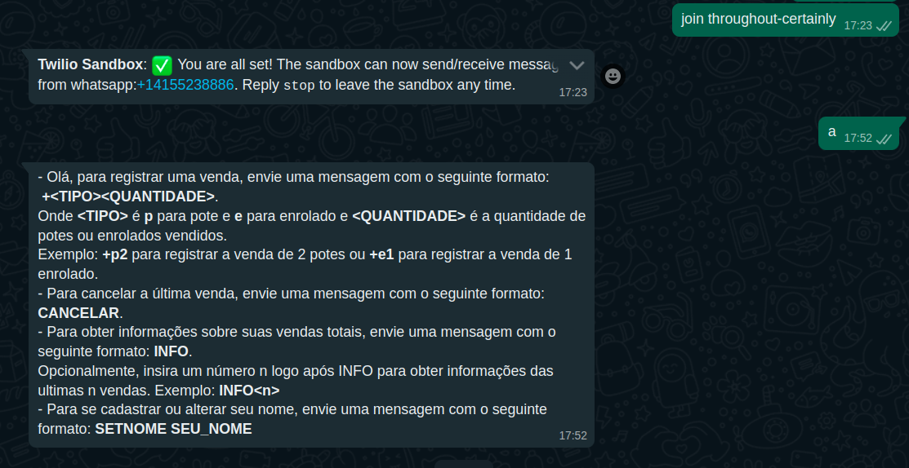

# Como rodar o servidor

## Instalar dependências

### Node

https://nodejs.org/en/download/

`npm install express body-parser twilio pg`

### Postgres

https://www.postgresql.org/download/

Criar as seguintes tabelas SQL

```sql
CREATE TABLE public.vendedor (
	id_vendedor serial4 NOT NULL,
	nome text NOT NULL,
	telefone text NOT NULL,
	CONSTRAINT vendedor_pkey PRIMARY KEY (id_vendedor),
	CONSTRAINT vendedor_telefone_key UNIQUE (telefone)
);
CREATE TABLE public.venda (
	id_venda serial4 NOT NULL,
	quantidade int4 NOT NULL,
	tipo text NOT NULL,
	receita float8 NOT NULL,
	hora_vendida timestamp NOT NULL,
	CONSTRAINT venda_pkey PRIMARY KEY (id_venda)
);
CREATE TABLE public.venda_vendedor (
	id_vendedor int4 NULL,
	id_venda int4 NULL,
	CONSTRAINT venda_vendedor_id_venda_fkey FOREIGN KEY (id_venda) REFERENCES public.venda(id_venda) ON DELETE CASCADE,
	CONSTRAINT venda_vendedor_id_vendedor_fkey FOREIGN KEY (id_vendedor) REFERENCES public.vendedor(id_vendedor) ON DELETE CASCADE
);
CREATE TABLE public.mensagem (
	id_request serial4 NOT NULL,
	telefone varchar(100) NULL,
	texto text NULL,
	hora timestamp NULL,
	CONSTRAINT mensagem_pkey PRIMARY KEY (id_request)
);
```

### Ngrok

Lembrar de setar a conta também

https://ngrok.com/download

## Rodar o servidor

`node server.js`

## Rodar o ngrok

`ngrok http 3000`

## Configurar o Twilio

Após rodar o ngrok, copie o link https gerado e cole nas configurações de sandbox, com /bot no final, em "When a message comes in".




**Lembrando que sempre que o ngrok for rodado seu link mudará, precisando mudar também no Twilio.**

## Testar

Envie uma mensagem para o número do Twilio _+1 415 523 8886_ com a seguinte mensagem

`join throughout-certainly`

Após isso, o bot já está funcionando.


